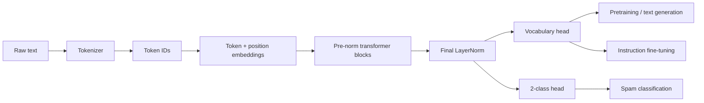

# GPT-2 From Scratch: Pretraining, Classification & Instruction FineTuning


A learning-first implementation of a GPT-style language model in PyTorch, taken all the way from tokenization and causal self-attention to pretraining, pretrained GPT-2 weight loading, spam classification, instruction fine-tuning, and LLM-as-a-judge evaluation.

The reusable model code under [`src/`](src/) is built from PyTorch primitives rather than `nn.Transformer` or a high-level model library. The project makes the machinery visible: token and positional embeddings, multi-head causal attention, pre-normalized transformer blocks, next-token loss, autoregressive decoding, checkpointing, and task-specific fine-tuning.

## What I built

| Stage | Work completed |
|---|---|
| GPT foundations | Rule-based tokenizers, GPT-2 BPE integration, sliding-window next-token datasets, token/position embeddings, LayerNorm, GELU, feed-forward layers, residual connections, and multi-head causal self-attention |
| Language model | A configurable decoder-only `GPTModel` with GPT-2 Small, Medium, Large, and XL architecture presets |
| Pretraining | Cross-entropy training and validation loops, token tracking, sample generation after each epoch, loss plotting, and model/optimizer checkpoints |
| Inference | Greedy decoding plus temperature sampling, top-k filtering, context cropping, and optional end-of-sequence stopping |
| GPT-2 compatibility | Downloading OpenAI TensorFlow checkpoints and mapping their embeddings, attention, MLP, and normalization weights into this PyTorch implementation |
| Classification fine-tuning | A balanced SMS spam classifier built from GPT-2 Small by replacing the language-model head and fine-tuning the last transformer block |
| Instruction fine-tuning | Alpaca-style prompt formatting, dynamic batch padding, ignored padding targets, and supervised fine-tuning of GPT-2 Medium |
| Evaluation | Response generation over the instruction test set and a local Llama 3.1 evaluation pipeline through Ollama |

## Architecture and task paths



## Recorded experiments

These are the outputs stored in the committed notebooks. They describe individual learning experiments, not general benchmark claims.

| Experiment | Configuration | Recorded result |
|---|---|---|
| SMS spam classification | GPT-2 Small (124M), balanced UCI SMS Spam Collection, 5 epochs; new binary head with the final transformer block and final LayerNorm unfrozen | **97.21% train**, **97.32% validation**, **95.67% test accuracy** |
| Instruction fine-tuning | GPT-2 Medium (355M), 1,100 instruction records, 85/5/10 train/validation/test split, 1 epoch | Training loss **3.826 -> 0.508** and validation loss **3.762 -> 0.664** in the recorded evaluation snapshots |
| Instruction evaluation | 110 generated test responses | Qualitative comparisons plus an Ollama/Llama 3.1 scoring pipeline; the notebook intentionally exposes both good responses and factual failures |

The instruction experiment is especially useful because it shows more than a happy-path demo: the fine-tuned model learns the requested response format and some transformations, while the saved examples also reveal hallucinations on factual questions.

## Guided notebooks

The three committed notebooks tell the project story from foundation to adaptation:

1. [`Code_Walkthrough.ipynb`](Code_Walkthrough.ipynb) — tokenization, data windows, embeddings, attention, the full GPT model, pretraining, decoding, checkpointing, and loading GPT-2 weights.
2. [`Classification-Finetuning.ipynb`](Classification-Finetuning.ipynb) — UCI SMS data preparation, class balancing, a GPT-2 classification head, selective unfreezing, training, evaluation, and spam/ham inference.
3. [`Instruction-Finetuning.ipynb`](Instruction-Finetuning.ipynb) — Alpaca prompt formatting, a custom collator, GPT-2 Medium supervised fine-tuning, response generation, checkpoint saving, and local LLM-based evaluation.

## Repository structure

```text
.
├── Code_Walkthrough.ipynb
├── Classification-Finetuning.ipynb
├── Instruction-Finetuning.ipynb
├── scripts/
│   ├── train.py                 # Pretraining CLI
│   └── generate.py              # Checkpoint inference CLI
├── src/
│   ├── config.py                # GPT-2 architecture presets
│   ├── data/dataset.py          # Sliding-window next-token dataset
│   ├── tokenizer/               # Regex tokenizers and GPT-2 BPE wrapper
│   ├── model/
│   │   ├── attention.py         # Multi-head causal self-attention
│   │   ├── layers.py            # LayerNorm, GELU, feed-forward network
│   │   ├── transformer.py       # Pre-norm transformer block
│   │   └── gpt.py               # Decoder-only GPT model
│   ├── generation/generate.py   # Greedy, temperature, and top-k decoding
│   ├── training/                # Loss, evaluation, and training loops
│   └── utils/                   # Checkpoints, plots, GPT-2 download/weight loading
└── requirements.txt
```

Datasets, downloaded GPT-2 checkpoints, generated plots, and trained `.pth` files are deliberately excluded from Git. This keeps the repository lightweight and avoids publishing large generated artifacts.

## Quick start

### 1. Install

```bash
git clone https://github.com/atharvahatekar/LLM-From-Scratch.git
cd LLM-From-Scratch
python -m venv .venv
```

Activate the environment:

```bash
# Windows PowerShell
.venv\Scripts\Activate.ps1

# macOS / Linux
source .venv/bin/activate
```

Then install the dependencies:

```bash
python -m pip install --upgrade pip
pip install -r requirements.txt
```

### 2. Build a small model and run a forward pass

This smoke test uses the real implementation with a reduced configuration, so it is practical on a CPU:

```python
import torch
from src import BPETokenizer, GPTModel, get_config

tokenizer = BPETokenizer()
cfg = get_config(
    "gpt2-small (124M)",
    context_length=64,
    emb_dim=128,
    n_heads=4,
    n_layers=4,
)

model = GPTModel(cfg)
tokens = torch.tensor(tokenizer.encode("Every effort moves you")).unsqueeze(0)
logits = model(tokens)

print(f"Parameters: {model.num_params():,}")
print("Logits:", logits.shape)  # (batch, sequence, 50,257)
```

### 3. Pretrain on your own text

Place any UTF-8 text corpus in `data/`, then run:

```bash
python scripts/train.py --data data/corpus.txt --epochs 10 --context-length 256 --batch-size 2 --checkpoint model.pth
```

The script automatically selects CUDA when available, creates a 90/10 train-validation split, trains with AdamW, prints generated samples, saves the model and optimizer state, and writes `loss-plot.pdf`.

### 4. Generate from the checkpoint

Use the same model preset and context length that were used during training:

```bash
python scripts/generate.py --checkpoint model.pth --context-length 256 --prompt "Every effort" --max-new-tokens 50 --temperature 1.0 --top-k 25
```

Set `--temperature 0` for deterministic greedy decoding.

## Loading genuine GPT-2 weights

The architecture is compatible with OpenAI's original GPT-2 checkpoints. TensorFlow is used only to read the original checkpoint format; inference still runs in the PyTorch model defined here.

```python
from src import BPETokenizer, GPTModel, get_config
from src.utils import load_weights_into_gpt
from src.utils.gpt_download import download_and_load_gpt2

settings, params = download_and_load_gpt2("124M", models_dir="gpt2")

cfg = get_config(
    "gpt2-small (124M)",
    context_length=1024,
    qkv_bias=True,
    drop_rate=0.0,
)
model = GPTModel(cfg)
load_weights_into_gpt(model, params)
model.eval()
```

Supported checkpoint sizes are `124M`, `355M`, `774M`, and `1558M`. Larger variants require substantially more memory and download space.

## Data used in the notebooks

The notebooks expect a local `data/` directory. Their source cells demonstrate preparation, but the resulting files are not committed.

- **Pretraining text:** [`the-verdict.txt`](https://raw.githubusercontent.com/rasbt/LLMs-from-scratch/main/ch02/01_main-chapter-code/the-verdict.txt), used for the compact language-model walkthrough.
- **Classification:** [UCI SMS Spam Collection](https://archive.ics.uci.edu/dataset/228/sms+spam+collection). The notebook downsamples the majority `ham` class, creates 70/10/20 splits, and expects the generated CSV files under `data/`.
- **Instruction tuning:** [`instruction-data.json`](https://raw.githubusercontent.com/rasbt/LLMs-from-scratch/main/ch07/01_main-chapter-code/instruction-data.json), containing 1,100 instruction/input/output records.

For the final instruction-evaluation section, install `psutil`, run [Ollama](https://ollama.com/), and make the `llama3.1` model available locally:

```bash
pip install psutil
ollama pull llama3.1
```

The evaluator sends deterministic prompts to the local Ollama HTTP endpoint and asks for a 0-100 score. No hosted evaluation API is required.

## Core API

| Import | Purpose |
|---|---|
| `get_config(...)` | Select a GPT-2 size and override context/model dimensions |
| `SimpleTokenizerV1/V2` | Inspect basic tokenization and unknown-token handling |
| `BPETokenizer` | Use the 50,257-token GPT-2 BPE vocabulary |
| `create_dataloader(...)` | Create shifted sliding-window input/target batches |
| `GPTModel` | Build the complete decoder-only transformer |
| `train_model_simple(...)` | Run next-token training with periodic validation |
| `generate(...)` | Decode with greedy, temperature, top-k, and EOS controls |
| `save_checkpoint/load_checkpoint` | Persist model and optional optimizer state |
| `download_and_load_gpt2(...)` | Download and read original GPT-2 checkpoints |
| `load_weights_into_gpt(...)` | Map checkpoint arrays into the PyTorch architecture |

## Implementation notes

- The model uses learned absolute positional embeddings and pre-LayerNorm transformer blocks.
- Attention uses separate query, key, and value projections, scaled dot products, an upper-triangular causal mask, attention dropout, and an output projection.
- The feed-forward network expands the embedding width by 4x, applies the tanh approximation of GELU, and projects back to the model dimension.
- Pretraining loss is computed over every token position; classification uses logits from the final sequence position.
- Instruction batches are padded dynamically. Extra padding targets are replaced with `-100`, so PyTorch cross-entropy ignores them.
- Generation always crops the active prompt to the configured context window.

## Acknowledgements

The learning progression, sample datasets, and original GPT-2 loading approach follow Sebastian Raschka's [*Build a Large Language Model (From Scratch)*](https://github.com/rasbt/LLMs-from-scratch). This repository turns that progression into a modular `src` package, executable scripts, and end-to-end fine-tuning experiments.
